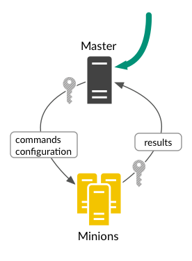
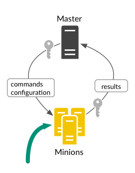

# Use Case
- [ ] Distribute Telegraf agents to <u>many</u> Linux and Windows VMs
- [ ] Configure the Telegraf agents to send data to an Aria Operations and be able to update it whenever we want
- [ ] Make sure we balance Linux and windows on different Cloud Proxies
- [ ] Monitor *services* on Windows and *processes/daemons* on Linux for uptime and performance insights.
- [ ] Create alerts for down services or processes

## Cloud Proxy
In Aria Operations, we use Cloud Proxies to boost network performance, scale up resources, and keep data safe. These proxies help us monitor cloud-based setups (or one or more vCenters) and expand our monitoring reach across different places.

## Configuration Management

SaltStack is a configuration management system let’s you define the applications, files, and other settings that should be in place on a specific system. The system is continuously evaluated against the defined configuration, and changes are made as needed.

##  The salt master

The Salt master is the central management system for sending commands and configurations to Salt minions on managed systems. We use it to execute commands, create reusable configurations, and apply the configurations to groups of systems. It's our tool for automating the deployment and maintenance of various things, like distributed apps, databases, files, user accounts, standard packages, cloud resources, and more. Saltstack sold by VMware used to be valled vRealize Automation SaltStack Config, but is called VMware Aria Automation Config. Don’t worry, it’s just a good old saltstack server, or the former SaltStack Enterprise, based on the Salt Project, meaning it is an open source automation software maintained by the Salt Project community.

## Salt Clients == “minions”

Minions are managed systems running the Salt minion, which follows commands from a Salt master. Aria Automation can distribute software, but vSphere itself offers a convenient shortcut – it includes the Salt minion with VMware Tools (VM Tools), making deployment effortless for “Salty Clients”.

## Telegraf Agents
A Telegraf agent is a versatile and powerful tool for collecting, aggregating, and transmitting metrics and data from a wide range of sources. It is an essential component in many monitoring and observability stacks, enabling us to gain insights into the performance and health of our systems, applications and infrastructure.  Telegraf is written in Go and compiles into a single binary with no external dependencies, and requires a very minimal memory footprint. 

## Salt and the Telegraf Agent
Salt, also known as *SaltStack*, is handy for software installation. With *Saltstack*, we can easily set up the Telegraf Agent to gather metrics from Linux and Windows servers and send them to Aria Operations (vROps) for monitoring and analysis.  

> Normally we could install Telegraf agents on an end point VM from the user interface of VMware Aria Operations or by running a script. We will be choosing the easy method using SaltStack. If you do **not** want to use Salt to do Remote execution, Configuration management, Automation and orchestration, meaning install, configure and manage the Telegraf agents then read the VMware documentation about [scripted installs on Windows and Linux](https://docs.vmware.com/en/VMware-Aria-Operations/SaaS/Configuring-Operations/GUID-0C121456-370C-467E-874B-38ACC93E3776.html), or even [single installations from the GUI](https://docs.vmware.com/en/VMware-Aria-Operations/SaaS/Configuring-Operations/GUID-0610FA99-1F01-47DF-ACF7-22B74F0296E7.html), but if you’re not mass-installing or any Automated Deployment at Scale, those methods are definitely not recommended. 

