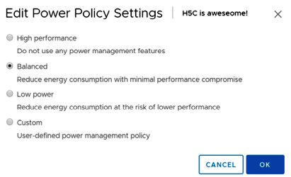

# vSphere Distributed Power Management 

The vSphere Distributed Power Management (DPM) feature optimizes power usage in virtualized data centers by dynamically adjusting server power states based on workload demand, saving energy and costs while maintaining high availability.  Its excellence lies in its ability to optimize power consumption and dynamically adjusts the power state of servers based on workload demand. Unused servers are powered off or placed in a low-power state.  This reduces energy costs, and contributes to environmental sustainability. So, have you tried to give DPM a second chance?  If not, please consider it, I mean for every kilowatt consumed by servers you would need cooling!

**Servers**, even when idle, consume power, which is a significant cost factor in data centers. By powering off servers

