# Sustainability is key for EU organizations
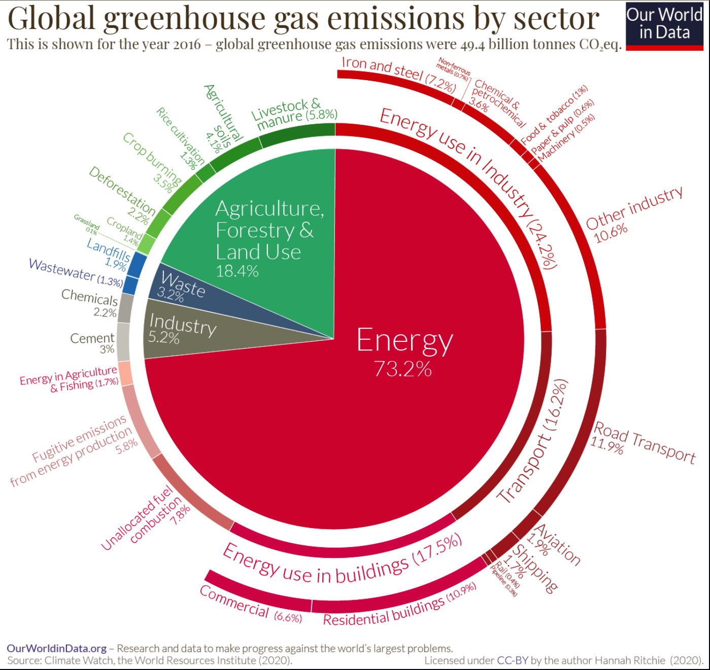 

GREENHOUSE GAS EMMISSIONS (GhG): 

We're cutting emissions and costs by optimizing workloads and promoting virtualization. 

A Green Score in Aria Operations tracks progress with five parameters, to target improvements, these are:

 *Workload Efficiency, Resource Utilization, Virtualization Rate, power Source, and Hardware Efficiency*. 

**[The large Hyperscalers are saving](https://bengt.no/post/2023-03-27/#hyperscalers-are-power-saving),** and so should we. 

<p> <p> <p> <p>

# vSphere Distributed Power Management 
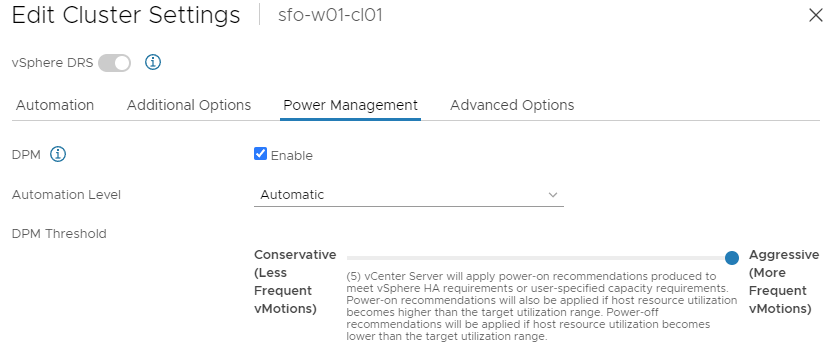

The vSphere Distributed Power Management (**DPM**) feature optimizes power usage in virtualized data centers by dynamically adjusting server power states based on workload demand, saving energy and costs while maintaining high availability.  Its excellence lies in its ability to optimize power consumption and dynamically adjusts the power state of servers based on workload demand. Unused servers are powered off or placed in a low-power state.  This reduces energy costs, and contributes to environmental sustainability. **So, have you tried to give DPM a second chance?**  If not, please consider it. For every kilowatt consumed by servers you would need cooling! 

- DPM uses Wake-on-LAN, IPMI, or iLO for powering on hosts.

- Prior configuration of IPMI or iLO is needed for each host before enabling DPM.

- Test exit standby for each host before enabling DPM.

- Individual host overrides are set from the Host Options page.

| **DPM Settings** | **Power Management** | **Power-On Conditions** | **Power-Off Conditions** |
|------------------|----------------------|-------------------------|--------------------------|
| **Off**          | No power management recommendations by vCenter Server. Overrides possible but inactive until Manual or Automatic is set. | - | - |
| **1**            | Applies recommendations for vSphere HA and capacity requirements. | - | - |
| **2**            | Applies recommendations for vSphere HA and capacity requirements. | Applied if host utilization much higher than target. | Applied if host utilization extremely low. |
| **3**            | Applies recommendations for vSphere HA and capacity requirements. | Applied if host utilization higher than target. | Applied if host utilization very low. |
| **4**            | Applies recommendations for vSphere HA and capacity requirements. | Applied if host utilization higher than target. | Applied if host utilization moderately low. |
| **5**            | Applies recommendations for vSphere HA and capacity requirements. | Applied if host utilization higher than target. | Applied if host utilization lower than target. |

##### For more Host power management options, **[have a look at this](http://localhost:1313/post/2023-10-03/)** 

# Powering off VMs
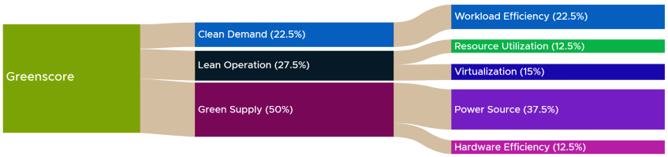

I am not going to talk more about Aria Operations much, in which you could Right-size VMs, Reclaim Wastage, Reclaim Hosts, Kill Idle VMs, Optimize Oversized Clusters, do SLA-based Operations, that would contribute to the Greenscore above. 

**Servers**, even when idle, consume power, which is a significant cost factor in data centers. By powering off servers (VMs) outside of work hours, we can improve workload efficiency, resource utilization, virtualization rate, power source efficiency, and hardware efficiency, ultimately leading to cost savings and a more sustainable data center operation.

By shutting down servers during off-hours, have positive effects, we...
* Reduce workloads in our data center, active servers run more efficiently, less thermal load. 
* Free up resources that can be allocated to other tasks, improving utilization 
* Consolidate active workloads onto fewer physical servers == Higher virtualization rate 
* Reduce power consumption, reducing our carbon footprint.
* Extend the lifespan of our hardware components and longevity. Less runtime of hardware 

Have a look at [**what google does**](https://bengt.no/post/2023-03-27/#an-example-on-how-google-does-it)

# New and Improved 
 After a **previous [series of articles](https://bengt.no/post/2023-03-27/),** we've improved the material behind the scenes. Now, when workloads are deployed, we've got improved scripting and reduced the number of orchestrator workflows to <u>ONE single workflow</u>,  and we can choose the **working hours** for the deployed servers in the UI. This means shut-down and Start-up procedures for servers will align more with the business needs and requirements. 


## Requesting a new deployment
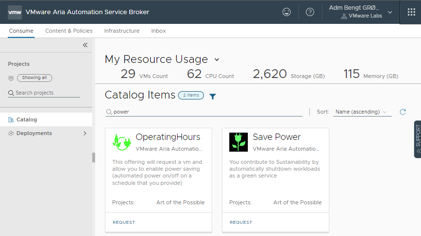 <br>
In the Aria Automation Service Broker, ie. the Self Service Portal, I now have a new Catalog Item “**OperatingHours**”, just to separate it from the Previous “Save Power” catalog item. Notice: In the search field, I have typed “power”. 
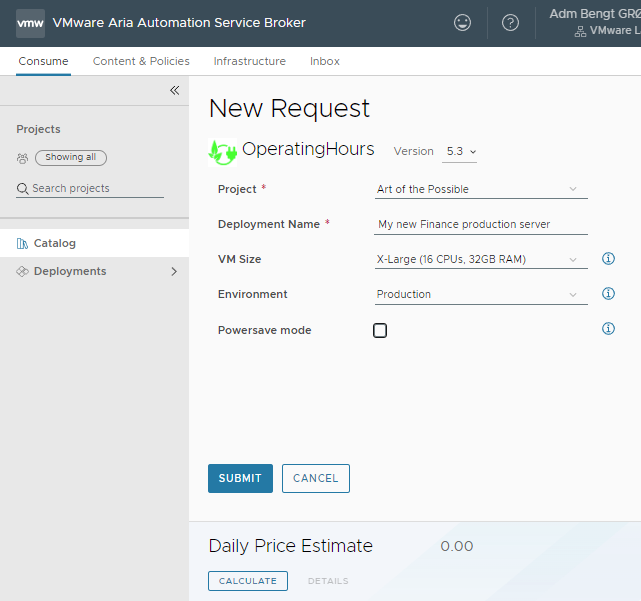<br>When I click “Request”, a new Form that differs slightly from the previous form pops up, and we can fill in our deployment name, the VM size, and which environment we would like this server to go into. Note: The server type (Linux/Windows) has been predefined in the Cloud Template for us. Just to make the example easier and more readable.  Let's Click the "Powersave Mode" checkbox.

==NEW!== 

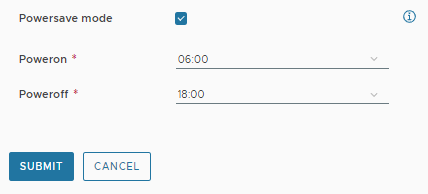  

Two New fields appear, where we can choose the Power On, and Power Off hours. I have selected **06:00** in the morning and **18:00** `(6pm)` in the evening. Now we just **Submit** it. 

### Deployment + Cloud Template

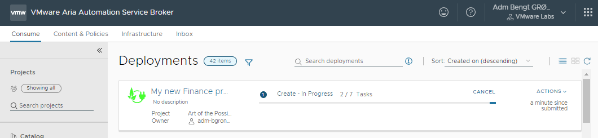

**TAGS:** After the deployment, we’ll see the vSphere tags produced by Aria Automation; `poweron: 6, poweroff: 18. os: windows, adv-powersave: true`

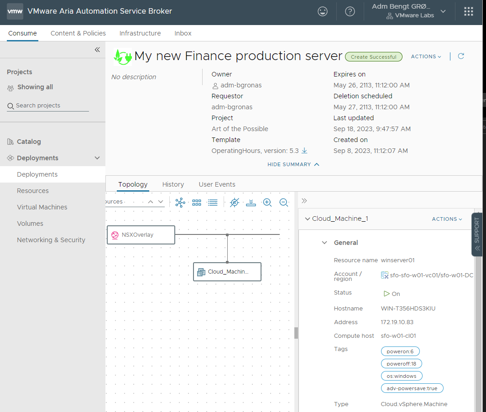

Let’s have a look at what’s behind the scenes! Let’s head over to the Aria Automation Assembler and have a look at our **cloud Template**: 

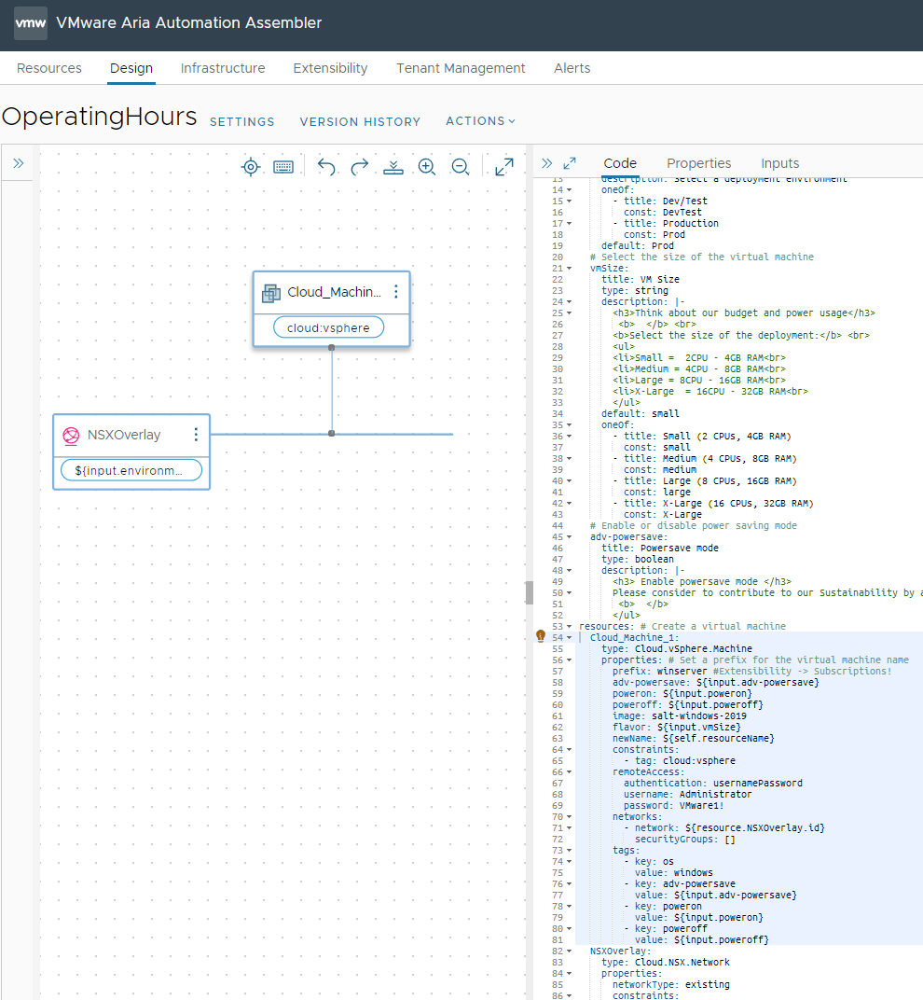 

### The Inputs

The Cloud Template inputs are rather easy, and have no magic attached to them

```yaml
  # Inputs to Enable or disable power saving mode, and set times
  adv-powersave:
    title: Powersave mode
    type: boolean
    description: |-
      <h3> Enable powersave mode </h3>
      Please consider to contribute to our Sustainability by automatically shutdown workloads as a green service <br>
       <b>  </b>
      </ul>
  poweron:
    type: integer
    minimum: 1
    maximum: 24
  poweroff:
    type: integer
    minimum: 1
    maximum: 24
```
### The Tagging

So is the vSphere tags that goes with it

```yaml
  # vSphere Tags for the new deployment
    tags:
        - key: adv-powersave
          value: ${input.adv-powersave}
        - key: poweron
          value: ${input.poweron}
        - key: poweroff
          value: ${input.poweroff}
```

  So basically you would end up with 3 tags, `adv-powersave=true, poweron=06:00, and poweroff=18:00`

### Failsafing the user Input in Service Broker

More behind the scenes, how do we control that the user puts in correct Times, (using *hh:mm*). Let’s head over to the Aria Automation Service Broker again. Let’s go to “Content and Policies” > “Content” , find our “OperatingHours” and go to “Customize Form” to make a Custom Request form. 

#### The Poweron and Poweroff fields
1) The Appearance. The only Magic here is that we show the poweron and poweroff fields only if you selected the boolean “powersave mode”. 
2) The Values.  As you can see from the next picture, our values are pre-defined for each hour. A little cumbersome, but it works.
3) The Constraints. We just give it an extra check if the constraints are between 1 and 24


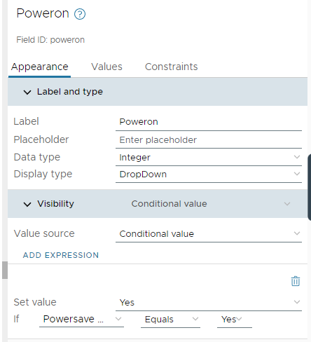
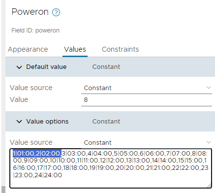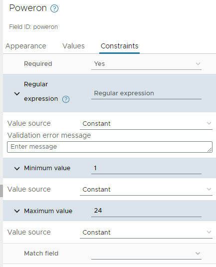

# Orchestrator Workflows

After the deployment, the machine is deployed in vSphere with it’s tags, and for now the Aria Automation job is done, except from the underlying and embedded workflow system Aria Automation Orchestrator. 

We have replaced the previous two workflows with a single workflow, and there is a schedule every hour. 

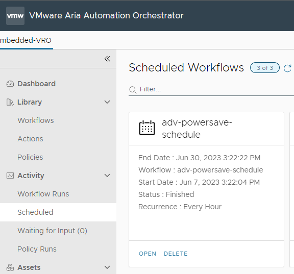 

##### A simple workflow with a single python script

Honors to [Lars Olsson, VMware Sweden](https://github.com/larols/vmware-aria), that has provided the Python code and the brains behind it.

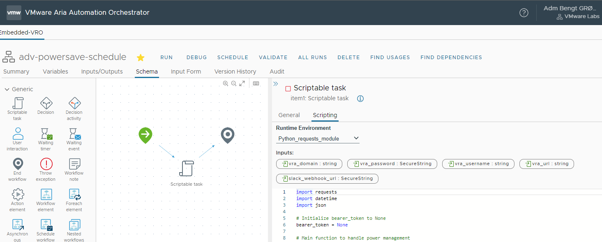

#### Checking the poweron and poweroff values 
```python
# Main function to handle power management
def handler(context, inputs):
    global bearer_token

# Retrieve bearer_token from vraauth function
bearer_token = vraauth(inputs)

# Obtain resource data with the "powersave" tag and poweron/poweroff values
resource_data = get_resource_ids_with_powersave_tag(bearer_token, inputs)

# Determine the current time on the server
server_current_time = datetime.datetime.now()

# Adjust the current time by adding the time difference (2 hours in this example)
current_time = server_current_time + datetime.timedelta(hours=2)

# Print the adjusted current time
print(f"Current time is {current_time.time()}")

# Extract the hour component of the current time
current_hour = current_time.strftime("%H")

# Check if the current time matches the poweron_value of any machine
for resource in resource_data:
    poweron_value = resource["poweron_value"]
    poweroff_value = resource["poweroff_value"]
    resource_id = resource["resource_id"]
    resource_name = resource["resource_name"]
    resource_address = resource["resource_address"]

    if poweron_value:
        adjusted_poweron_hour = int(poweron_value) - 1
        if current_time.hour == adjusted_poweron_hour:
            #send_to_slack(f"POWERSAVE: Powering on resource ID: {resource_id}", inputs)
            power_on_resource(resource_id, resource_name, resource_address, inputs, bearer_token)

    if poweroff_value and current_time.hour == int(poweroff_value):
        #send_to_slack(f"POWERSAVE: Powering off resource ID: {resource_id}", inputs)
        power_off_resource(resource_id, resource_name, resource_address, inputs, bearer_token)

# No action needed for other cases
```

##### Find vSphere resources with powersave tags and retrieve the values

```python

# Function to get resource IDs with "powersave" tag and retrieve poweron and poweroff values
def get_resource_ids_with_powersave_tag(bearer_token, inputs):
    # vRA API URL
    url = inputs["vra_url"]
    # vRA API headers with bearer token
    vraheaders = {
        "accept": "application/json",
        "content-type": "application/json",
        "Authorization": "Bearer " + bearer_token
    }
    # Initialize an empty list to store the resource IDs and their poweron and poweroff values
    resource_data = []
    # Use a session to make multiple requests to the vRA API
    with requests.Session() as session:
        # Make a GET request to the /deployments endpoint to get deployments where resourceTypes=Cloud.vSphere.Machine and tags:adv-powersave=true
        resp = session.get(f"{url}/deployment/api/resources/?resourceTypes=Cloud.vSphere.Machine&tags=adv-powersave:true", headers=vraheaders, verify=False)
        # Raise an error if the response status code is not 200 OK
        resp.raise_for_status()
        # Get the content of the response
        json_resp = resp.json()

    # Loop through each resource
    for item in json_resp["content"]:
        # Get the resource ID, name, and address
        resource_id = item["id"]
        resource_name = item["name"]
        resource_address = item["properties"]["networks"][0]["address"]
        
        # Initialize poweron and poweroff values as None
        poweron_value = None
        poweroff_value = None
        
        # Get the "properties" field
        properties = item["properties"]
        
        # Loop through each tag in the "properties" field and check for poweron and poweroff values
        for tag in properties.get("tags", []):
            if tag["key"] == "poweron":
                poweron_value = tag["value"]
            elif tag["key"] == "poweroff":
                poweroff_value = tag["value"]
        
        # Append the resource ID, name, address, and its poweron and poweroff values to the resource_data list
        resource_data.append({
            "resource_id": resource_id,
            "resource_name": resource_name,
            "resource_address": resource_address,
            "poweron_value": poweron_value,
            "poweroff_value": poweroff_value
        })

# Return the list of resource data
return resource_data
```


##### power off 
```python

# Function to power off a specific resource
def power_off_resource(resource_id, resource_name, resource_address, inputs, bearer_token):
    # vRA API URL
    url = inputs["vra_url"]
    # vRA API headers with bearer token
    vraheaders = {
        "accept": "application/json",
        "content-type": "application/json",
        "Authorization": "Bearer " + bearer_token
    }
    # vRA API payload to power off the resource
    payload = {
        "actionId": "Cloud.vSphere.Machine.Shutdown",
        "inputs": {},
        "reason": "Power Off"
    }
    # Send the power off request to vRA using the requests library
    with requests.Session() as session:
        resp = session.post(f"{url}/deployment/api/resources/{resource_id}/requests", headers=vraheaders, json=payload, verify=False)
        try:
            # Raise an error if the response status code is not 200 OK
            resp.raise_for_status()
            # Send a message to Slack to inform that the resource is being powered off
            send_to_slack(f"SustainaBot: Power off successfully called for resource: {resource_name} - {resource_id} (Address: {resource_address})", inputs)
        except requests.exceptions.HTTPError as err:
            # If the status code is 400, log the error and continue to the next resource
            if err.response.status_code == 400:
                print(f"SustainaBot: Power off failed for resource: {resource_name} - {resource_id} (Address: {resource_address}): {err}. Is it already powered off?", inputs)
            else:
                # If the status code is not 400, raise the error
                raise
```
##### power on 
```python
# Function to power on a specific resource
def power_on_resource(resource_id, resource_name, resource_address, inputs, bearer_token):
    # vRA API URL
    url = inputs["vra_url"]
    # vRA API headers with bearer token
    vraheaders = {
        "accept": "application/json",
        "content-type": "application/json",
        "Authorization": "Bearer " + bearer_token
    }
    # vRA API payload to power on the resource
    payload = {
        "actionId": "Cloud.vSphere.Machine.PowerOn",
        "inputs": {},
        "reason": "Power On"
    }
    # Send the power on request to vRA using the requests library
    with requests.Session() as session:
        resp = session.post(f"{url}/deployment/api/resources/{resource_id}/requests", headers=vraheaders, json=payload, verify=False)
        try:
            # Raise an error if the response status code is not 200 OK
            resp.raise_for_status()
            # Send a message to Slack to inform that the resource is being powered on
            send_to_slack(f"SustainaBot: Power on successfully called for resource: {resource_name} - {resource_id} (Address: {resource_address})", inputs)
        except requests.exceptions.HTTPError as err:
            # If the status code is 400, log the error and continue to the next resource
            if err.response.status_code == 400:
                print(f"SustainaBot: Power on failed for resource {resource_name} - {resource_id} (Address: {resource_address}): {err}. Is it already powered on?", inputs)
            else:
                # If the status code is not 400, raise the error
                raise

```

##### Send to slack

```python

# Function to send a message to a Slack channel
def send_to_slack(message, inputs):
    # Slack webhook URL
    webhook_url = inputs["slack_webhook_url"]

# Slack message payload
payload = {
    "text": message
}

# Send the message to Slack using the requests library
response = requests.post(
    webhook_url, data=json.dumps(payload),
    headers={'Content-Type': 'application/json'}
)

# Raise an error if the response status code is not 200 OK
if response.status_code != 200:
    raise ValueError(
        f'Request to Slack returned an error {response.status_code}, the response is:\n{response.text}'
    )
```
##### When time comes, slack messages look like this:

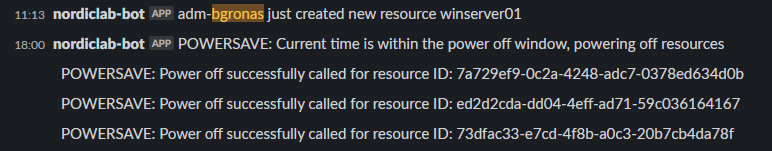