# Better & faster vs. Save power!
The technological wonders we've created have undoubtedly made our lives more connected, better and faster. Our dependency on IT infrastructures has grown, and so has also the ***demand for power***.  But with a  passion for sustainability, let’s talk about the server power-saving techniques, particularly in a vSphere environment. 

In my previous article I talked about the vSphere feature **DPM**, or Distributed Power Management, to power off hosts dynamically when the demand is low. [Go and have a look.](https://bengt.no/post/2023-09-08/)   This article complements the VMware Explore session where my buddy [Valentin Bondzio](<vbondzio@vmware.com> ) explained his "no Risk HPM" methodology. Note: It starts at 27:52 in the session [Orange journey to reduce their carbon emissions & Focus on HPM](https://www.vmware.com/explore/video-library/video-landing.html?sessionid=1683885521040001LU2d&videoId=6340794321112) - Head over to his Blog [No Risk Host Power Management](https://valentin.bondz.io/no-risk-host-power-management/). 

In this article we’ll try to deep dive a bit into Efficiency. From Dell's BIOS up to vSphere’s cluster settings, every tweak plays a part. Let’s have a look at the BIOS settings, iDRAC, and a little quick trip to vSphere's power management suite. 

**Unlocking Power Savings: ** Since my tiny home lab consists of 2x Dell PowerEdge R720 with Integrated Dell Remote Access Controller (iDRAC) to enable advanced remote management capabilities using vSphere, that’s what I will be covering here. 

# Dell BIOS

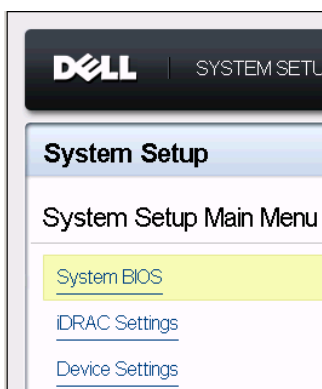

The nerve center of your server, where energy efficiency begins. When the Server boots up, use the F2/DEL trick and enter the Dell BIOS and change the System Profile settings from what’s default, to either Custom or Performance-per-watt (OS), otherwise known as “OS Control”.

 
## System performance profiles
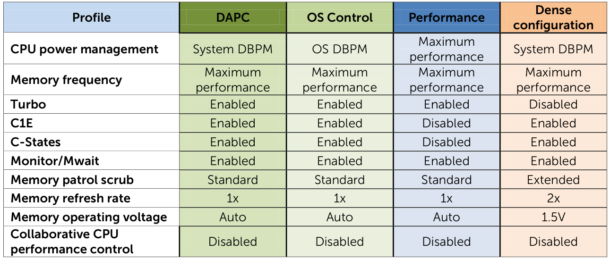 Here is an overview of the available performance profiles that are available for us to select and enable in the BIOS. 

## Selected System Profile
We’ve selected **Custom** just to make sure we have unlocked any sustainability possibility, but I’m quite sure the OS Control/OS DBPM is more than sufficeint. *Note:* this option by itself has no defaults for the options. The default state of all of the options is based on the last System Profile selected. So, First select the “*Performance-per-watt (OS)*”, and then go for *Custom*… *or not..*

## Power Management BIOS Settings  {#bios}
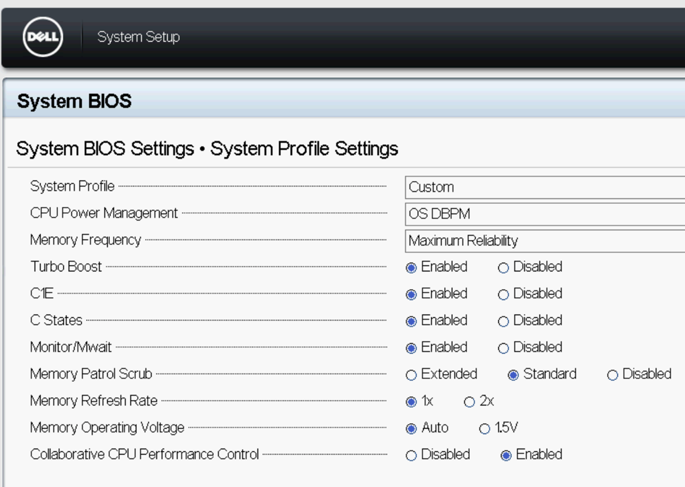 In order to allow ESXi to control CPU power-saving features, set power management in the BIOS to “**OS Controlled Mode**” or equivalent. Even if you don’t intend to use these power-saving features.  In this configuration, Turn ON Turbo Boost too (not shown). The Memory Frequency could also be left as-is, but we’ve also changed that.

**C-states:** In order to get the best performance per watt, you should activate all C-states in BIOS. This gives
you the flexibility to use vSphere host power management to control their use. C-states can reduce performance. In these cases you might obtain better performance by disabling them in the BIOS.

**C1E** is a hardware-managed state; when ESXi puts the CPU into the C1 state, the CPU hardware can determine, based on its own criteria, to deepen the state to C1E. Availability of the C1E halt state typically provides a reduction in power consumption with little or no impact on performance.

> **Storage Latency Sensitive Workloads.** For a very few multithreaded workloads that are highly sensitive to I/O latency, such as financial platforms or media and entertainment, C-states (including C1E) can reduce performance. In these cases you might obtain better performance by deactivating them in the BIOS. Deactivate C1E and other C-states ==  increase power consumption.

## Recommended BIOS settings
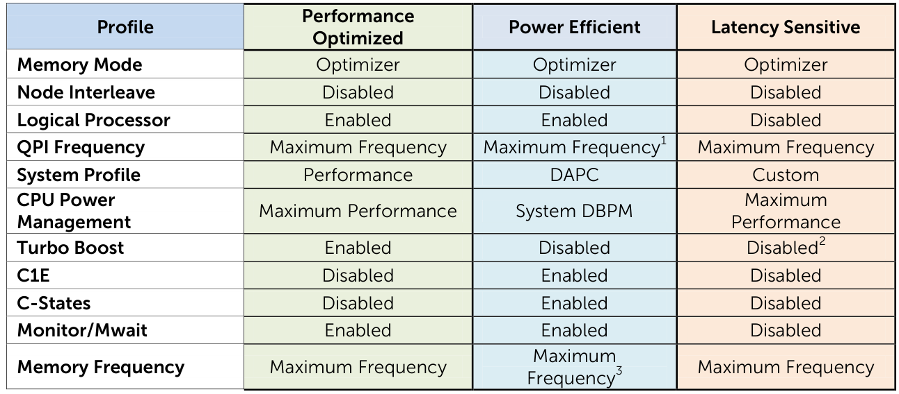
I was about to change the Memory Frequency, but didn’t, in hope to maximize Power Savings and most performance pr. Watt. 

## DELL iDRAC Essentials
`Access and Log in to the iDRAC Web Interface, Navigate to the IPMI Settings, Enable IPMI Over LAN, Apply/Save Changes.` 
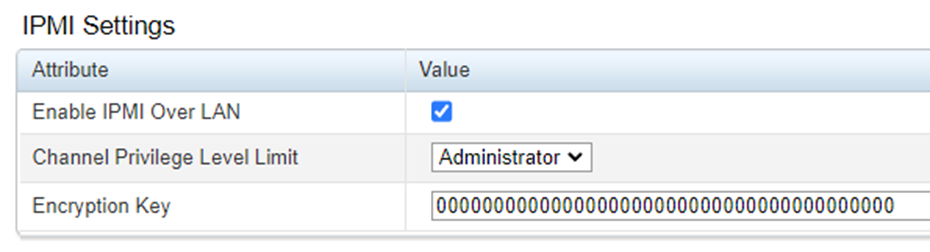Distributed Power Management (DPM) typically use IPMI for out-of-band management. This allows VMware DPM to power on or off the server when necessary to save power. 

## iDRAC Network IP and MAC ADDRESS  {#idrac}
You will need this when you are later going to configure the vSphere IPMI/iLO Settings for Power Management, meaning the actual handshake between Hardware and Software. Make a note of both the MAC and IP [for later use](#ip_mac). 

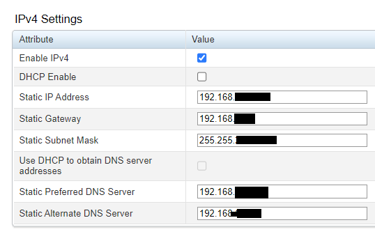   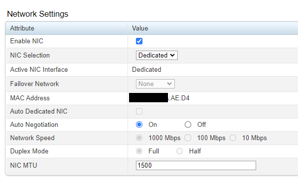 

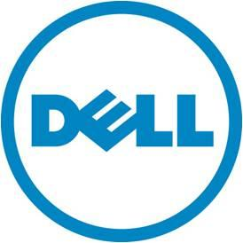Now that we’ve done the BIOS and iDRAC (ILO) settings, it’s about time to enter vCenter and do the rest of the configuration in vSphere.  Follow **Dell** *BIOS Performance and Power Tuning Guidelines* for Dell PowerEdge 12th Generation Servers for *Configuring the servers BIOS for optimal performance and power efficiency*. 

## vSphere Power Management Essentials

We can focus on energy efficiency by prioritizing power conservation while maintaining performance with certain vSphere settings:

| **Feature**                   | **Role in Power Saving**                                     |
| ----------------------------- | ------------------------------------------------------------ |
| **System Profile Settings**   | Harmonizes performance and energy efficiency.                |
| **IPMI/iLO Power Management** | Vital for integrating hardware and software power settings.  |
| **Configuration**             | Navigate to 'Host Options' for tailored power management strategies. |
| **vSphere Cluster Dynamics**  | Adjust 'DRS Automation' levels from 'Conservative' to 'Aggressive' for optimal power use. |
| **Balance vs. Conservation**  | Choose between 'Balanced' and 'Low Power' modes in 'Host Power Management' to prioritize energy saving. |

## IPMI (Intelligent Platform Management Interface) or iLO (Integrated Lights-Out) 
IPMI/iLO is a feature of the server hardware. After configuring IPMI/iLO in the BIOS/firmware, we leverage these settings in vSphere for remote server management tasks, including power management. In vSphere we use features like Power Management policies that can interact with IPMI/iLO. To access the IPMI/iLO Settings for Power Management settings in in vSphere click the `host>configure>system>Power Management.` 

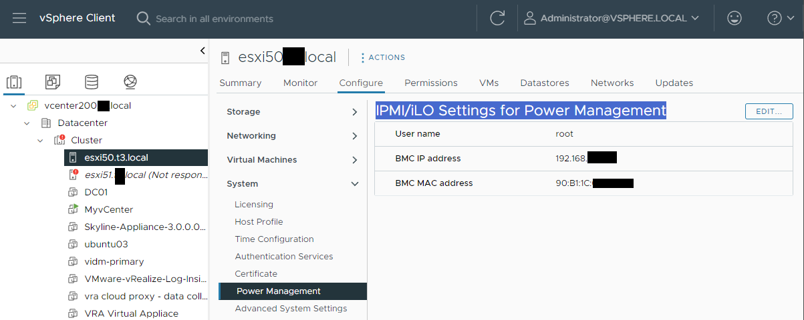

Click **Edit** to set the connection details for our Dell server. 

## IPMI/ILO Settings for power management{#ip_mac} 

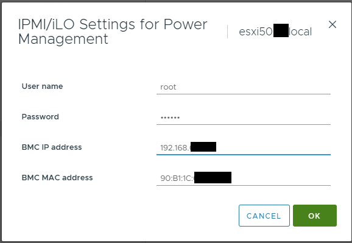 
Put in the iDRAC IP and MAC [from above](#idrac) and click OK. 

## Host Power Management Policies in ESXi
| **ESXi Host Power Management Policies** | **Description**                                  |
| :-------------------------------------- | ------------------------------------------------ |
| Static / High Performance               | Maximizes performance, minimal energy savings.   |
| Dynamic / Balanced                      | Balances performance and power consumption.      |
| Low Power                               | Prioritizes energy savings, reduces performance. |
| Custom                                  | User-defined settings for specific needs.        |

Availability of these policies depends on host hardware support for power management as mentioned and described above.  ESXi aims to minimize energy consumption with minimal performance impact. 

Click `Configure>Hardware>Overview and scroll to the bottom`: 
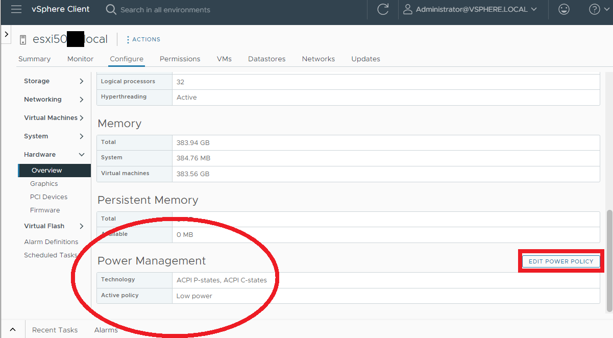

Notice, we have got a “Low Power” setting here. Let’s change it to “Balanced”,  Click **EDIT POWER POLICY**

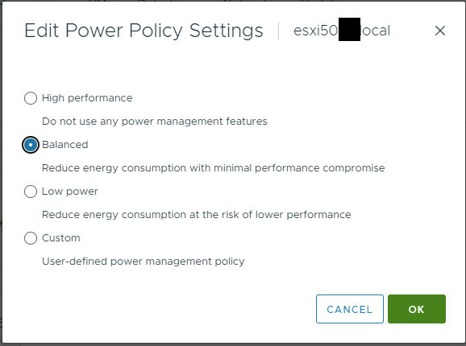 
Set our power policy settings according to everything else we’ve [set in the BIOS above](#bios). 

# Aria Operations 
### Host Monitoring. Operations Dashboard {#dash}

We'll use an Operations tool for efficient monitoring of key host parameters, avoiding extensive checks in vCenter/vSphere Client. Essential parameters include:

> BIOS version and date, BIOS power-saving settings, P and C states. vSphere power policy. ESXi version. Serial number, and hyperthreading.
>

Creating this dashboard is easy and straightforward. We'll build a view with all necessary data. But very first, let’s review our policies to ensure we're capturing all essential host metrics, such as power, BIOS version, etc.

### Metrics and Properties collection

In Aria Operations, Let’s go to `Configure>Policies>Policy Definition` and *edit* our policy.

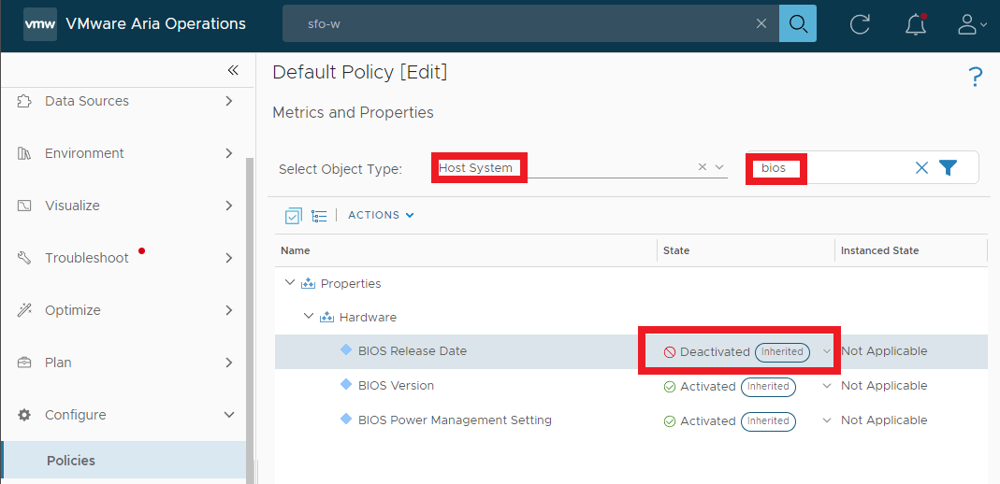 

Object type is ‘**Host System**’ and we’ll filter on ‘**bios**’. As we can see the *“BIOS Release date”* is inherited and Deactivated. Let’s **activate** it from the Drop Down menu, and click **Save**. 

### View

Let’s go to `Visualize>Views>Manage`, and search for “Properties”, find the view called “**Host Key Properties**”. that looks pretty similar to what we want.  Tip: Learn from the content.

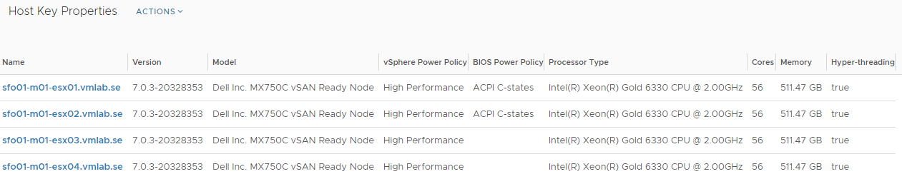 

- Let’s just create a new one from scratch, go back to *Manage* and Click **Add**, then select **List** 

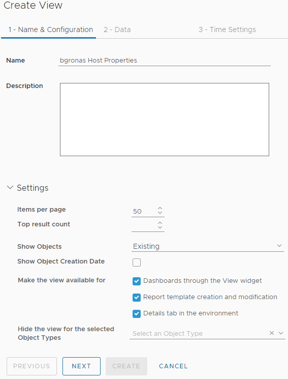 

- Click **Next** (not shown)

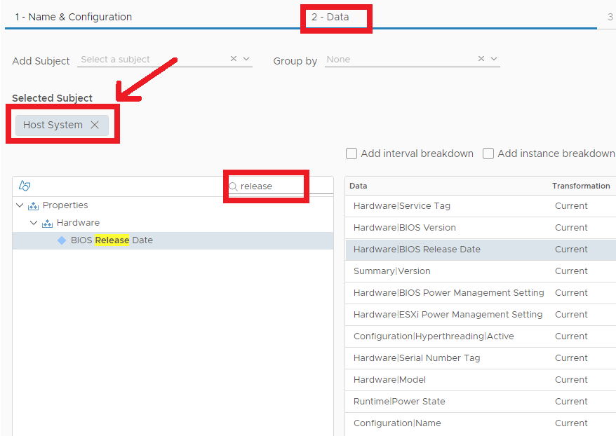 

In the next tab we will just add everything we’ve listed [above](#dash)

- Start by Add Subject: **Host System**
- In the search field, type **bios**, **release**, **power**, **hyperthread** etc. and add everything we need, make it look closely to the image above. 
- Next **rename** the columns, make sense with our naming;

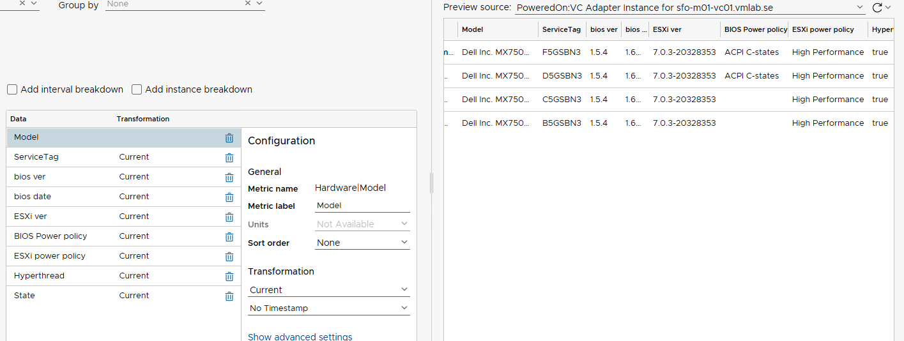 

#### View result {#view} 

- Click **CREATE**. The end result should look something like this: 

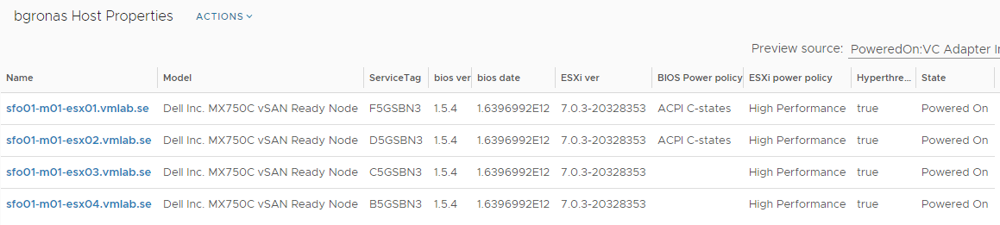 

### Dashboard

- Go to `Visualize>Dashboards>Manage` and click **Add**

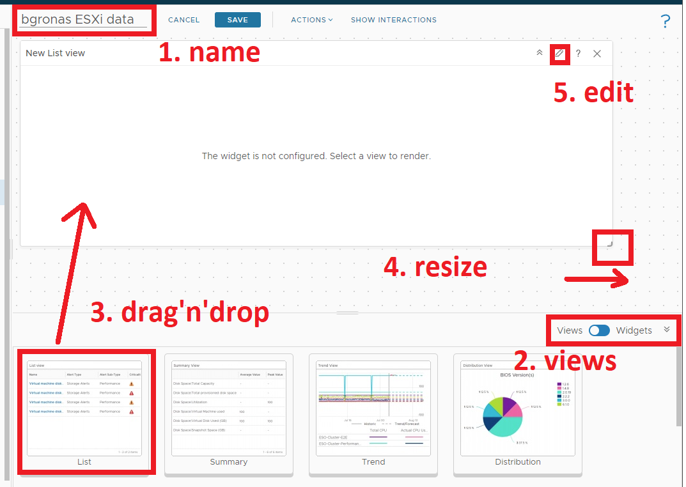

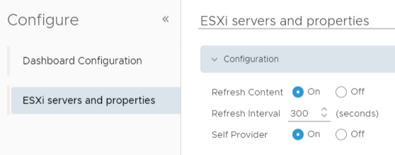 

- Name your dashboard, for example: “*ESXi Servers and properties”*
- You will be a **self provider** = on

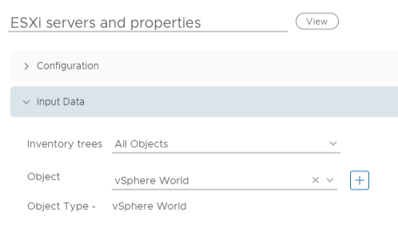 

- All objects and Object = **vSphere World**

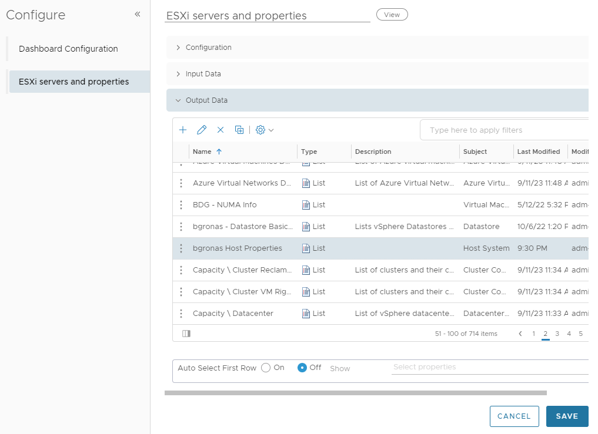

- Expand Output data, and select the previous created [view](#view) and click **SAVE**

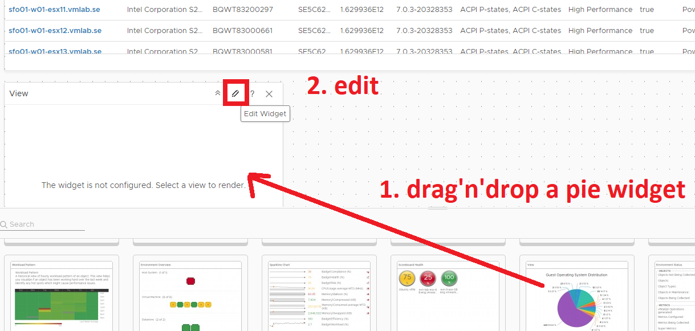 

- Add a Pie widget and edit it

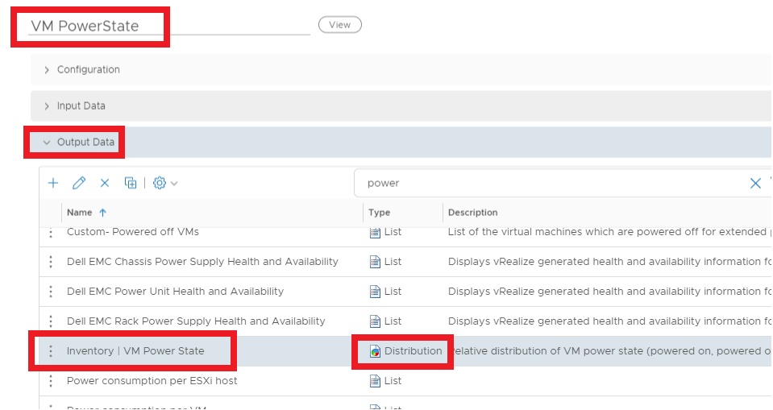   

- Name it
- Select **Inventory | VM Power State**
- Click **Save**
- Click **Show Interactions**

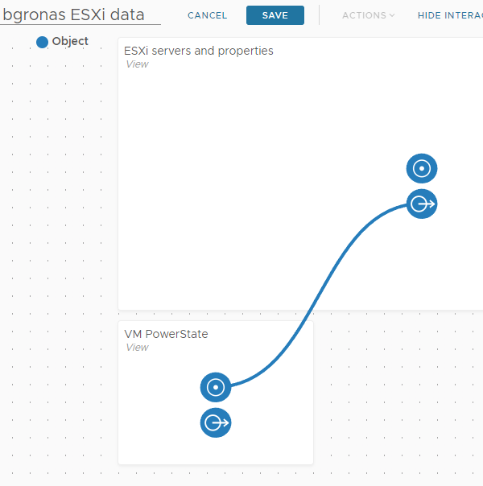 

- Add the interaction 
- Click **SAVE**

### The End result

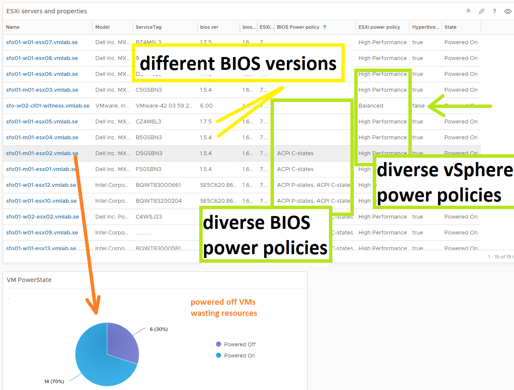 

### LINKS

- [Host Power Management Policies in ESXi](https://docs.vmware.com/en/VMware-vSphere/8.0/vsphere-resource-management/GUID-4D1A6F4A-8C99-47C1-A8E6-EF3865603F5B.html)
- [Managing Power Resources](https://docs.vmware.com/en/VMware-vSphere/8.0/vsphere-resource-management/GUID-5E5E349A-4644-4C9C-B434-1C0243EBDC80.html)
- "[No Risk Host Power Management](https://via.vmw.com/no-risk-hpm)"
  

until next time..
