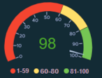

VMware Aria Operations 8.17.1 is here and there are some great new features added. 
Note: Aria Operations and all other Aria products are all part of VMware Cloud Foundation (VCF)

# Enhancements
- Fresh vSAN Dashboard
- Private AI and GPU Monitoring 
- Workload Placement (WLP) historical task events to show more data
- Workload Placement (WLP) history support using REST API
- Workload Placement(WLP) Action Based Notification support
- New API to assign priorities to policies in Aria Operations
- Payload templates scope awesomeness

**Read all about those enhancements here: https://blogs.vmware.com/management/2024/04/whats-new-in-vmware-aria-operations-8-17-1.html**

# Best enhancement, ever!

> GAUGES !

 <– If you notice from the article about enhancements on the VMware Blog, you can clearly see that there is a Gauge widget. That’s the best enhancement I’ve seen since 2020. Hands Down.   **Yes, it’s for real!** 
