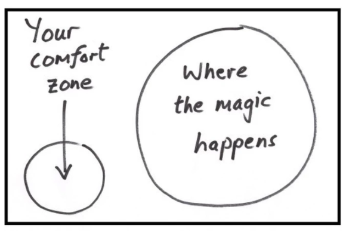
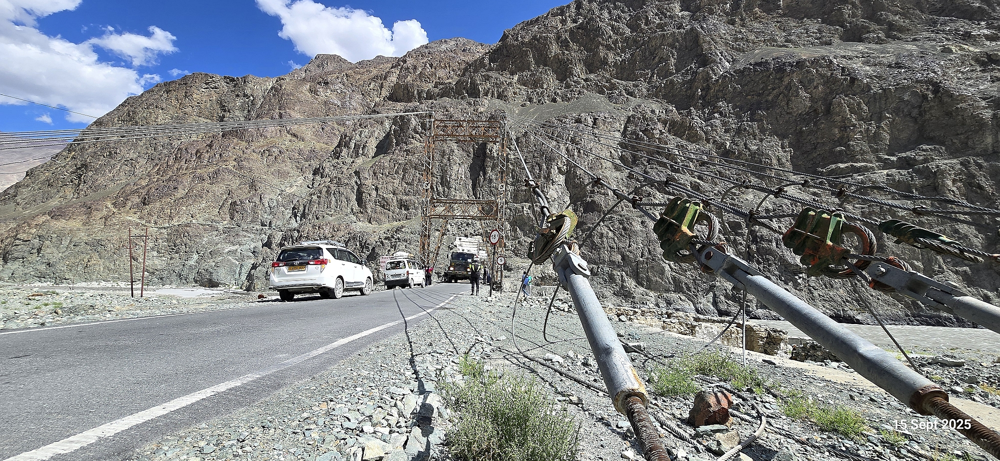
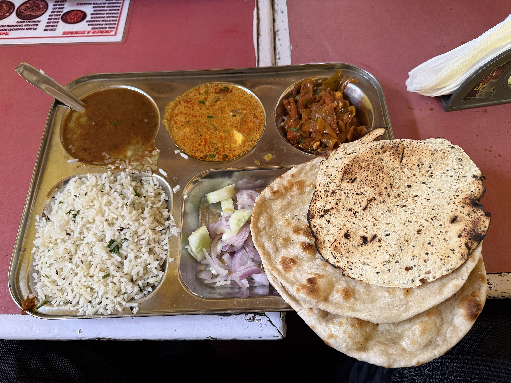

**Dette er til deg som lurer på om dette kan være noe for deg...**

# Himalaya på MC 

 I september 2025 var vi med Norind Adventures på en episk motorsykkeltur i Himalaya. Blant tingene vi opplevde var dager med MC ekspedisjoner i regionen **Ladakh**. Vi kjørte gjennom ganske mye ekstreme landskap — snødekte fjell, gjørme og regn, tørre ørkener, daler, høydedaler, alpine innsjøer og sanddyner og sist men ikke minst Kjøring over **pass**.   Terrenget varierer fra asfalt til røff stein, grus og sand. Noen ganger var det hardt arbeid, andre ganger følelsen av å seile gjennom eventyrlige Himalaya-landskap. 

## Hvorfor Himalaya 

 Jeg har kjørt mye motorsykkel før, men Himalaya er i en annen liga. Det er ikke bare høyden, men kombinasjonen av kultur, landskap og det å vite at feilside av grøfta ikke er en åker – men et juv. 

Derfor var det viktig å reise med noen som faktisk kan området. Dette er en del av verden der veiene nesten ikke finnes :-) 

[**Royal Enfield Himalayan 411**](https://www.instagram.com/p/DOrxWbrEqrN/?utm_source=ig_web_copy_link&igsh=NTc4MTIwNjQ2YQ==) er ikke raske, men de er bygget for dette – grus, stein, gjørme og veier som egentlig bare er forslag.  Vi vasser i månelandskap, gamle klostre, trange daler, høye pass, panoramautsikt og en følelse av at du er veldig langt unna alt. Den lille trofaste performer veldig bra og er en kul sak å ha i fjellheimen.

En av de beste mc-dagene: rundtur fra **Hanle**  [med high speed gjennom ørken ](https://www.instagram.com/reel/DOxGnjpEnu6/?utm_source=ig_web_copy_link&igsh=NTc4MTIwNjQ2YQ==), opp til **Umling La** (5798 moh) 
[Å stå der oppe, med Himalaya i alle retninger, er vanskelig å beskrive](https://www.instagram.com/p/DO240FsDG3h/?utm_source=ig_web_copy_link&igsh=NTc4MTIwNjQ2YQ==). Man får en helt annen respekt for høyde, vær og logistikk. 

Denne MC-opplevelsen handlet mer om flyt og utholdenhet enn fart. For min del var dette ikke en ferietur, men en **rekalibrering**. Det er vanskelig å komme hjem og irritere seg over småting når du nettopp har stått på *nesten* 6000 moh og kjent på **…. livet.** 

Uansett - Det du får, er dramatiske naturopplevelser, fjell, kultur og adrenalin. Hva er feilen med å ligge på en strand? Jo, dette er ikke definitivt en standard ferie — det er en reise du husker, ikke polert «MC-tur light» - **Her lager du minner for livet!** 

Turen passer bra for alle, men det er ofte en grei ting om du føler at du mestrer litt grus før du kommer. Men ikke frykt noe, hverken politiske problemer med nabolandene, skremsels-videoer eller synsinger fra youtube og instagram om alt fra politisk klima til dårlige veier. Du blir ivaretatt og sett, og alle starter samtidig og kommer i mål samtidig, dette er ikke en konkurranse. 

Til slutt sitter du med dette som en "**referanse-opplevelse**" og måler etterhvert alle opplevelsene både tidligere og kommende opp mot Himalaya MC-turen din. 

# Her er min erfaring

- **Reisen til/fra India** er lang og det kan bli venting. Ta fram det flegmatiske i deg. Det kan være greit med noe å dra over hodet når du skal stunt-sove litt her og der.  Noen kalde kvelder kan det bli, men en enkel tynn jakke (hooded insulator) er nok. 
- MC-Jakke + bukse **-foret** kan legges igjen hjemme. Du trenger ikke dette. Jeg syntes det var VELDIG greit å ha med **egen hjelm** og dobbel-visir. En lang syntetisk **stilongs** og etpar langermet syntetisk eller **ull-undertøy** er fint. Enkelte pass kan være delvis kalde. Noen frossenpinner kjører med tjukke fleece under. For min del var **vinterhansker** det eneste tjukke jeg hadde. Jeg angrer aldri på det., jeg er en helårs vinterhanske kjører. 
- Vi ble alle "rare" i kroppen da vi landet på 3500moh. Vi startet i byen Leh – Vi hadde et fantastisk hotell. Et døgn der gjorde underverker. Kroppen må faktisk **«bo» i høyden**. Ikke-no' macho-opplegg, bare utrolig smart **akklimatisering**.
- Du bør ha litt **MC-erfaring** og være greit komfortabel på grus/ujevn vei. Du trenger ikke være ekstrem, men du må tåle lange dager og anpassing til høyde. 
- Etter dag 2 er det kanskje lov å være litt **verdensmester** om du kjenner deg comfy. Men husk at det er guiden som kjenner veien, selv om du vil forbi.  Mye av veien i Himalaya går jo bare en vei, så der vil være rom for å "**stikke ifra**" om du vil kjøre hardere på i tungt svingete grusveier om du er erfaren. Helt greit om man avtaler på forhånd hva man har tenkt. 
- ***«VEI»*** i Himalaya betyr alt fra fin asfalt til grove elveleier. Syklene tåler det utrolig nok, selv om du er en stor person.  Du trenger ikke ha utstyrs-angst, det triller fremover uansett. 
- Selv om **mekanikeren** kanskje ser ung og uerfaren ut, og du sier at "du har prøvd alt", og kjenner at du vet best.. STFU - Trust the mecanic! Disse gutta kjenner syklenes luner.  De er Indias *"fjorden cowboys"* og får start på skiten uansett hva du måtte tro og mene. 

- **Royal Enfield Himalayan** – den har ikke hastverk, den bare går. Jeg tror at om man er litt 'villmann', er dette den perfekte Himalaya sykkelen.  En tung R1300GSA doning for dette eventyret er bare tull. 

- Du bør like å være **ute av komfortsonen** – på den gode måten.  Ta steget, Ikke frykt noe, det er ingeting å være redd for. **Ikke** snakk deg selv ned før du drar. Du kjører der "Itchyboots" har kjørt før. Klarte hun dette alene, klarer du dette i gruppa di :-) [Se videoene hennes på youtube.](https://youtu.be/XDyThbPQkK0?si=gZuICeZqi6dYz0Gg&t=190)
- Før du drar, **ikke** kom opp med dårlige unnskyldninger hvorfor du ikke skal dra. Ikke avlys uansett hva omgivelsene krever av deg. Husk at jobben din står med åpne armer og tar i mot alt du har å gi når du kommer tilbake. Det samme gjør din bedre halvdel og ungene.. 

- Du blir sveiset sammen med de du drar med, uansett hvor 'quirky' de måtte være. **Gjengen din** blir ditt sosiale nettverk og diskusjonspartner mens du er på tur. Skulle du være litt filosof eller konversasjonsstarter er det bare fint, eller så kan man jo bare diskutere magetrøbbel etter middag ;-)
  
- Du bør ha gode **RAM mounts** til GoPro til å sette på motorsykkelen.  Note: etthvert kamera som tar bort "risting" er good-to-go, du trenger ikke det siste og beste og dyreste, men robuste fester er et must.  

- **Høydesyke** har ingenting med fysisk form eller noe annet å gjøre, her bukker selv den beste under, det er individuelt hvordan kroppen reagerer, og du har ingen kontroll. [**Diamox**](https://www.felleskatalogen.no/medisin/diamox-amdipharm-547926) er en grei medisin å bruke for høyde. Du får den på resept hos fastlegen. Start med den 2 dager før du lander i India. 
- **Airtel** eSIM kort var det eneste som fungerte på landsbygda
- **Håndsprit** er et must. Del med de andre hele tiden. den som har, gir. 

- **Immodium** er bra å ha med, slik at du kan stoppe opp magen om det trengs.  Jeg fikk bruk for det på avreisedagen. Et lite mikro-apotek er bra å ha med. 

- [**Kolera Drikkevaksine**](https://www.felleskatalogen.no/medisin/dukoral-valneva-548165) er lurt å få i seg 14 dager før du drar (gjør magen mer robust). De fleste klarer seg fint med magen og maten, men det kan hende man enkelte dager har det best i nærheten av et toalett rett etter måltider. 

- Ellers er det greit å friske opp **barnevaksinene, og hepatitt**. Du trenger ikke allverden av vaksiner for denne turen. 
  Husk hjertemedisin for 3 uker om du bruker slikt.

- Ha alltid med deg **lypsyl/lipomade** i høyden. Jeg glemte dette, og da blir leppene litt innsnurpet ørken.  

- Hør på de lokale! Drikk MYE **vann**, gjerne te. 

- Selv du tåler **alkohol** godt, vil kroppen vanligvis si fra, og ditt konsum blir garantert 1/10 av det "vanlige". Det ble derfor en relativt uviktig ting på turen. Vi hadde oss etpar whisky etter maten på kveldene, noe som er en perfekt dessert. Note: Her er det lov å by på! Crew'et fortjener en *"liten en"* i hver fot. 

# Hvorfor Norind gjengen?

Norind, både som Norsk og Indisk avdeling kombinerer trygghet med frihet. 
Alt det praktiske er allerede ivaretatt — logistikk, overnatting, sykler, drivstoff, mekaniker og følgebil — så du kan fokusere på opplevelsen. 

Du kan ha med en stor reisekoffert som blir behørlig transportert på lasteplanet på følgebilen.  Jeg hadde til og med en **laptop** i en sekk (film/bildebackup etc.).
	
Hvis sykkelen svikter, er hjelpen allerede på plass. Jeg hadde en clutch-wire som røyk i en lang nedoverbakke. Den ble skiftet på under 4 minutter. Hvis du en dag kjenner deg totalt utslitt på tur, kan du sitte på i følgebilen igjennom en etappe for å hente deg inn. 

Opplegget er profesjonelt, men samtidig ganske personlig, det føles veldig som en **familie**. Guidene kjenner Himalaya, været, veiene og hvordan man håndterer uforutsette situasjoner — noe som er avgjørende når du kjører i ekstreme høyder og krevende terreng. Det gir en trygg ramme rundt eventyret — mer frihet på tur, mindre bekymring rundt det praktiske.

>
> ### Jeg sier bare GOD TUR!!!!
> ##### Hilsen fra Top of the world: 
>

# Bildegalleri / Andre bilder

> ### Me & my Buddy Kim

> ###  59 år! Litt tidligere på året…

