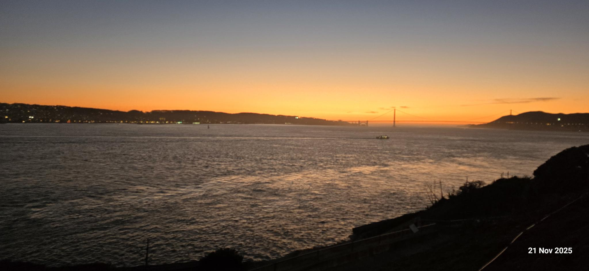
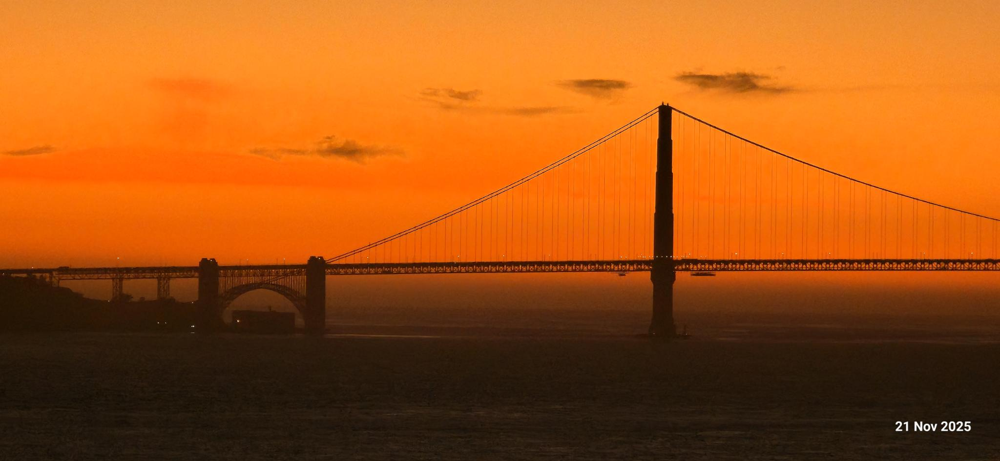

# 4,7 km-illusjonen

Den **21. november 2025**, mens jeg sto på **Alcatraz Island**, tok jeg et håndholdt bilde av **Golden Gate Bridge** med en **Samsung Galaxy S24 Ultra**. Bildet ble tatt med omtrent **20× zoom** (kanskje mer). Resultatet ble overraskende nok tilfredsstillende. Broen ser nærmere ut. Kameraet fikk avstanden til å se kort ut … men … **Den geodetiske avstanden (rett linje) mellom Fort Point og Alcatraz er omtrent 4,7 km!!** Dette er en koordinatbasert, geodetisk måling uavhengig av veier, ruter, tidevann eller egen visuell vurdering.

*Referanse-bilde som viser hele spennet mellom Alcatraz og Fort Point.*

*Åpent vann gir nesten ingen mellomliggende dybdeledetråder, noe som gir skeiv avstandsvurdering.* Dette bildet viser den faktiske skalaen, men kameraet skaper illusjonen. Begge disse bildene ble tatt med **Samsung Galaxy S24 Ultra** (kom ut i Januar 2024).

| Komponent         | Spesifikasjon                      |
| ----------------- | ---------------------------------- |
| Hovedkamera       | 200 MP, f/1.7 vidvinkel            |
| Ultravidvinkel    | 12 MP                              |
| Telefoto          | 10 MP, ~3× optisk                  |
| Periskop-telefoto | 50 MP, ~5× optisk                  |
| Maksimal zoom     | Opptil 100× (hybrid/digital)       |
| Stabilisering     | Optisk + elektronisk               |
| Prosessering      | Multiramme-beregningsfotografering |

> Ifølge **DXOMARKs kameratest** av Galaxy S24 Ultra: **Styrker**: Svært høy detalj i sterkt lys, sterk tele-ytelse, og forbedret håndtering av tekstur og støy sammenlignet med forrige generasjon. **Begrensninger**: Av og til ustabil fokus, fokusoverganger i video kan henge etter, og ikke helt ledende i son klasse i alle scenarier. Kort sagt: kameraet er teknisk sett mer enn godt nok.

## Zoom

Ved **20× zoom** kombinerer telefonen høy grunnoppløsning, optisk forstørrelse og aggressiv beregningsbasert skarping. Det den **ikke** gjør, er å redusere den fysiske avstanden.

*20–30× zoomet opptak av Golden Gate Bridge fra Alcatraz.*

## 4,7 km ser kortere ut

**Telekompresjon:** Lange brennvidder komprimerer dybde langs synsaksen. Forgrunn, mellomgrunn og bakgrunn ser “stablet” tettere sammen. Effekten brukes i film, sportsfoto og overvåkingsbilder.
**Vann fjerner dybde:** Mellom Alcatraz og Fort Point finnes det ingen bygninger, veier, trær eller parallakse-referanser. Flatt vann er omtrent den dårligste overflaten for menneskelig avstandsvurdering.
**En enorm struktur:** *Golden Gate Bridge er gigantisk — hovedspenn på ca. 1 280 m og tårn på ca. 227 m.* Store objekter signaliserer ubevisst nærhet, selv når de er langt unna.

For å gjøre avstanden mer normalisert for Norske eller Europeiske forhold— her er noen referanser:

### Avstandsreferanser

| Sted / referansepar                                    | Geodetisk avstand |
| ------------------------------------------------------ | ----------------- |
| Fort Point → Alcatraz Island (San Francisco)           | ~4,7 km           |
| Tamburveien 3 (Nydalen) → **Oslo** Operahus (Bjørvika) | ~4,6–4,8 km       |
| Slemmestad-kysten → Kolbotn-kysten (**Oslofjorden**)   | ~4,5–5,0 km       |
| Tower Bridge → Canary Wharf (**London**)               | ~4,6–4,8 km       |

Man skjønner nå, at Alcatraz-**svømmeturer** ble undervurdert. Avstanden er faktisk ~4,7 km. note: *Alle avstander referert i denne artikkelen er geodetiske (rett linje).*
