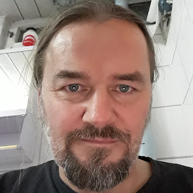

# I AM

 Senior Systems Engineer at Nutanix Norway. My work focuses on the Nutanix Platform and supporting customers including the public sector. Expertise includes Hybrid Multicloud, Hyperconverged, Software defined <whatever>, and systems administration. Operating from Oslo. Personal goals involve blogging, public speaking, and technical instruction. I bridge complex infrastructure with cloud-native operations.

### Professional Experience & Focus

Before Nutanix I spent over a decade at VMware (2013–2025) as a Specialist Solutions Engineer covering cloud management, automation, and orchestration across the Nordics and Baltics. Six-time vExpert. I built a lot of Hands-On Labs, ran SociaLab community sessions around Norway, and got to watch virtualisation, Operations, and automations reshape enterprise IT from the inside. I served as a sustainability ambassador, advocating for eco-friendly data centre management. Broadcom's acquisition brought that chapter to a close — I wrote about it [here](/post/2025-01-10/).  Before VMware, many years as a senior consultant and systems engineer across various corners of Norwegian IT.

## Technical Philosophy

Infrastructure should be invisible and automated. My background in VCF products informs my current work with Nutanix anything, anywhere, autonomy. I focus on reducing operational friction for deployments. Security is a baseline requirement, not an afterthought.

## Beyond the terminal

I'm a motorcyclist, I enjoy the logistical planning of long-distance motorcycle trips. I am a occasional weightlifter, and a chronic tinkerer.  On any given week you might find me:

- Music production, guitar collecting, and recording in a home studio that runs on neoclassical shred, metal, funk, and organ-driven weirdness in roughly equal measure.

- I slightly maintain a competitive interest in chess - Playing some correspondence chess. Badly, but with conviction.

- Shooting photos — mostly landscapes and motorcycles, sometimes both at once.

- Disappearing into the Norwegian backcountry with a tent, a caravan, a camera, and no cellular signal.

- Health is always managed via data and clinical evidence. My interest in longevity research prioritizes cardiovascular health and metabolic optimization. European/Nordic guidelines as health interventions, well maybe. Chasing VO₂max numbers and reading longevity research — ApoB, Lp(a), plaque regression. The rabbit hole is deep and I like it down here.

- Creative pursuits provide a necessary cognitive shift. 

  I live in Oslo with my wife and teenagers, who tolerates all of the above.

## Find me

- [LinkedIn](https://www.linkedin.com/in/bgronas/)
- [GitHub](https://github.com/bgronas)

