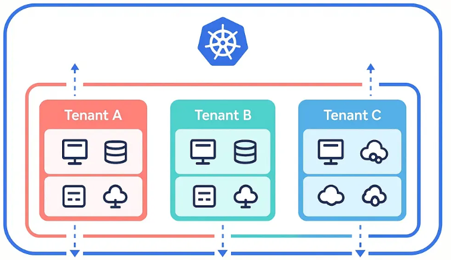
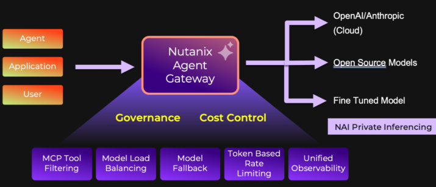

**Høstens konferansesesong er startet for lenge siden – men du kan slippe mange flyreiser.** Nutanix kjører en rekke gratis, tekniske online webinarer utover høsten. De kan være verdt en liten time (eller to).  

Fra ditt første Kubernetes-cluster til en ekte enterprise-plattform, GitOps i praksis, datasuverenitet og en hands-on-Lab om fremtidens virtualisering. Her er litt av hvert.  Første multi-rikskringkastning er allerede **onsdag 30. september**.

## På Web (Norsk tid)

| Dato | Klokken | Webinar |
|---|---|---|
| Ons 30. september | 11:00 | [From Your First Kubernetes Cluster to an Enterprise Platform](https://event.nutanix.com/from1clustertoanenterpriseep2) |
| Ons 7. oktober | 11:00 | [Multitenancy and GitOps in Practice](https://event.nutanix.com/multitenancygitopsinpractep3) |
| Tir 13. oktober | 11:00–12:00 | [Navigating Data Sovereignty in the Hybrid Multicloud Era](https://event.nutanix.com/navigatingdatasovereignty) |
| Fre 16. oktober | 10:30–12:30 | [The Future of Virtualization](https://event.nutanix.com/thefutureofvirtualizationoct) (HANDS ON LAB) |

## 1. Fra første cluster til enterprise-plattform – 30. september

Ett enkelt K8s cluster er easy-peacy. 10 clustre lukter plattform. Her går vi fra enkeltcluster til en arkitektur der management og produksjon er skilt i egne workload clusters, med produksjonsklare tjenester, ***observability*** og et privat container registry. Dette er Episode 2 i Kubernetes-serien.

 [Meld deg på](https://event.nutanix.com/from1clustertoanenterpriseep2)

## 2. Multitenancy og GitOps i praksis – 7. oktober

Mange team, én plattform, intet kaos. Denne Episode 3 viser hvordan Nutanix Kubernetes Platform (NKP) partisjonerer ressurser og tilganger sikkert, hvordan GitOps ruller ut applikasjoner på tvers av fleets (clusters), og hvordan *Insights* fanger opp avvik før noen andre luringer gjør det.

 [Meld deg på](https://event.nutanix.com/multitenancygitopsinpractep3)

## 3. Datasuverenitet i hybrid multicloud – 13. oktober

Hvem kontrollerer dataene – egentlig? Dette er en times tid; om å beholde workloads der de skal være, sikre edge mot ransomware, unngå lock-in og det å gjøre compliance enkelt. Dette er særlig relevant for **offentlig sektor, helse og finans**.

 [Meld deg på](https://event.nutanix.com/navigatingdatasovereignty)

## 4. The Future of Virtualization – 16. oktober

To timer hands-on. Dette er ikke slides. Du får kjøre vår Hypervisor (AHV) selv, navigere i Admin verktøyene Prism Central og Prism Element, og **se hvordan VMware-workloads migreres**. Hensikten er at du skal fra total uvisshet til å planlegge en PoC.

 [Meld deg på](https://event.nutanix.com/thefutureofvirtualizationoct)

## Last ned, små-les i forkant

- [Enterprise AI on Nutanix](https://www.nutanix.com/viewer/go/enterprise-ai-on-nutanix) – e-bok
- [Five Steps to Navigate Enterprise AI](https://www.nutanix.com/viewer/content/dam/nutanix/en/resources/infographics/inf-five-steps-to-navigate-enterprise-ai.pdf) – infografikk
- [Navigating Kubernetes Complexity with Nutanix](https://www.nutanix.com/viewer/content/dam/nutanix/en/resources/infographics/inf-navigating-kubernetes-complexity-with-nutanix.pdf) – infografikk

## Bonus: Agent Gateway

Gikk du glipp av [Agent Gateway: Architecting the Future of AI](https://event.nutanix.com/theagenticgatewayarchitectingt)  den 4. september? Den handlet om kontrollplanet mellom AI-modeller og agenter – governance, kostnadskontroll   [aka. TOKENOMICS] og skalering av autonome agenter uten å gi slipp på datasuvereniteten. Sjekk siden for opptak. 

## Vi ses - på skjermen 

Velg én. Eller velg alle fire. Ta med deg kollegaen som *«skal se på Kubernetes snart»* – og ta gjerne spørsmålene med til neste Nutanix User Group i Oslo. 

#Nutanix #Kubernetes #CloudNative #DevOps #GitOps #HybridCloud #K8s